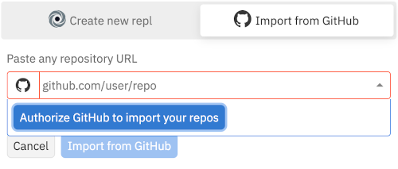
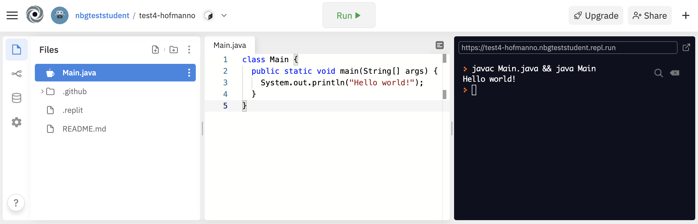
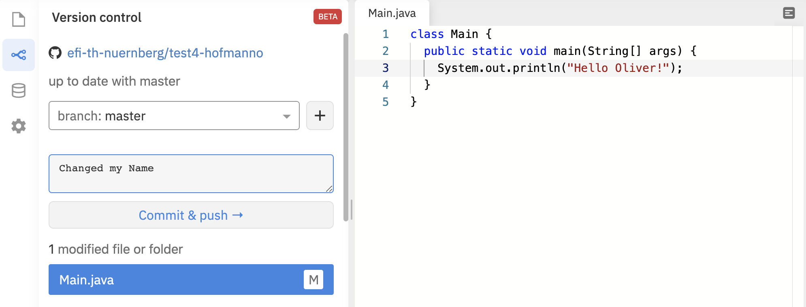

# Software Engineering im Studiengang Media Engineering

## Assignment #1

### Organisatorisches

Herzlich Willkommen zu den Online-Praktika von Software Engineering.
Da aufgrund von Corona die Praktika online stattfinden sollen, haben wir aus der Not 
eine Tugend gemacht und versucht, die Praktikumsteilnahme ohne 
besondere Anforderungen an den heimischen PC zu ermöglichen. Eine Installation
von Software sollte nicht nötig sein - Sie benötigen lediglich einen 
funktionsfähigen Browser. Alle Werkzeuge und Tools sind online kostenfrei 
nutzbar - lediglich eine E-Mail-Adresse für die Registrierung/Anmeldung
wird benötigt. Sie können dafür Ihre TH-Mail oder auch eine beliebige andere 
Adresse verwenden.

#### GitHub 
Für die Verteilung der Aufgaben und die Abgabe von Lösungen verwenden wir
GitHub bzw. GitHub Classroom. Dazu benötigen Sie zuerst einen kostenfreien
Account beim [Web-Dienst GitHub](https://github.com/). GitHub ist der 
führende Anbieter von freien Code-Repositories im Internet. Bekannte aktuelle
Open Source Tools und Bibliotheken werden auf GitHub als Git-Repository gehostet, z.B.
* Tensorflow 
* Visual Studio Code
* Corona Warn-App
* ...

Aufgaben erhalten Sie in Form eines *Assignment-Links* z.B. via Moodle oder 
im Chat zur Praktikumslehrveranstaltung. Nach dem Öffnen des Links haben
Sie die Möglichkeit, das Assignment anzunehmen. In diesem Fall wird für Sie 
eine Kopie der zur Aufgabenstellung gehörenden Dateien auf GitHub angelegt
und Ihnen die URL zu diesem Repository mitgeteilt. In dieser Kopie nehmen Sie 
anschließend auch Ihre Ergänzungen vor, um die Aufgabe zu lösen.
Die Aufgabenstellung finden Sie in der ebenfalls enthaltenen Datei
*README.md*, die beim Öffnen des Repository-Links angezeigt wird. 

#### Repl.IT
Für die Bearbeitung der Ausgabenstellung und die Abgabe verwenden
wir mit dem [Web-Dienst Repl.IT](https://repl.it/) ebenfalls einen
kostenlosen Web-Dienst, bei dem Sie sich registrieren müssen.
Auch hier können Sie eine beliebige Mailadresse verwenden. 
Als Nutzernamen sollten Sie aber den gleichen Namen verwenden, 
den Sie auch bei Github angegeben haben.

Repl.IT ist ein Online-Editor samt Ausführungsumgebung für eine
Vielzahl von Programmiersprachen. Wir werden in dieser Veranstaltung
hauptsächlich Java verwenden. Auf diese Weise vermeiden wir, dass
Sie sich eine Java-Entwicklungsumgebung installieren müssen und 
ermöglichen zugleich, dass Sie kollaborativ am Programmcode arbeiten
(dazu später mehr).

Nachdem Sie sich angemeldet haben, können Sie Ihr erstes Projekt 
(im Tool "repl" genannt) erzeugen. Dies soll auf Basis des ersten 
Assignments geschehen, das Sie von GitHub importieren.
Dazu müssen Sie Repl.IT
die URL zum Repository mit Ihrer Assignment-Kopie mitteilen und Repl.IT 
das Recht einräumen, mit Ihren Zugangsdaten auf GitHub zuzugreifen.

Tragen Sie im Dialog die URL zu Ihrer Kopie ein und erlauben Sie
Repl.IT mit dem Button "Authorize GitHub to import your repos"
den Zugriff auf die Aufgabenstellung. Importieren Sie anschließend
das Repository.

#### Repl.IT Oberfläche

Die sich ergebende Obefläche besteht aus mehreren Bereichen. Ganz links
wählen Sie die Sicht auf Ihr Projekt:

 zeigt die Dateien des Projekts an.

 ermöglicht die Interaktion
mit dem Repository auf GitHub.

---

Im Bereich *Files* sehen Sie die Dateien Ihres Projekts. 
Neben den Programmcodedateien finden Sie hier auch die Aufgabenstellung
in *README.md* sowie eine Konfigurationsdatei *.replit*, die vor allem
festlegt, was nach dem Klick auf den *Run*-Button passieren soll.

Der Mittelteil der Oberfläche ist Ihr Editor, in dem Sie Dateien 
bearbeiten können. Änderungen werden in einem ersten Schritt nur beim
Tool Repl.IT gespeichert und noch nicht in Ihr Repository auf 
GitHub übertragen.

Ganz rechts sehen Sie ein Terminalfenster, in dem die Ausgaben 
von Repl.IT und Ihrem Programm angezeigt werden.

---

Anders als im ersten Semester ist der Startpunkt eines Java-Programms 
normalerweise die *main*-Funktion einer Klasse. 
M.a.W.: Mindestens eine Ihrer Klassen sollte eine 
solche main-Funktion beinhalten. 

Die Signatur der *main*-Funktion ist vorgegeben und lautet immer

`public static void main(String[] args)`

In der Signatur tauchen einige Schlüsselworte auf, 
die Ihnen bekannt sein sollten:

* Was bedeutet `public`? Und gibt es Alternativen?
* Was bedeutet `static`? 
  Unterscheiden Sie die Verwendung bei Attributen und bei Methoden!
* Was bedeutet `void`?

Verändern Sie das vorgegebene Programm so, dass anstelle von
*Hello world!* Ihr Name ausgegeben wird. Starten Sie die Ausführung 
mit dem *Run*-Button und überprüfen Sie Ihr Ergebnis.

---

Sofern alles geklappt hat, ist es an der Zeit, Ihre Änderung 
zum Repository zu übertragen. 

Wechseln Sie dazu zur Repository-Sicht, beschreiben Sie kurz Ihre 
Änderungen und veranlassen Sie mit dem Button *Commit & push* die 
Übertragung.

### Aufgabenstellung

Nachdem Sie die zu verwendenden Tools jetzt etwas kennen, können wir
uns an die erste Aufgabe machen.

Schreiben Sie ein Programm, das alle Zahlen von 1 bis 200 in einer 
Schleife durchgeht und folgende Ausgaben erzeugt:

* Bei Zahlen, die durch 5 teilbar sind, 
  soll ausgegeben werden: „ZAHL ist durch 5 teilbar!“
* Bei Zahlen, die auf 9 enden, soll ausgegeben werden: 
  „ZAHL endet auf 9!“
* Bei Zahlen, die addiert mit ihrem Vorgänger eine Zahl ergeben, 
  die durch 3 teilbar ist, soll ausgegeben werden: 
  „ZAHL und VORGÄNGER addiert ergeben ERGEBNIS und 
  ERGEBNIS ist durch 3 teilbar“ 
  (Bsp: 5 und 4 addiert ergeben 9 und 9 ist durch 3 teilbar.)
 
Erzeugen Sie dazu eine neue Klasse `Zahlenfilter` mit einer
eigenen *main*-Funktion. Passen Sie die Dateo *.replit* so
an, dass Ihre neue Klasse übersetzt und als Startpunkt verwendet
wird.

